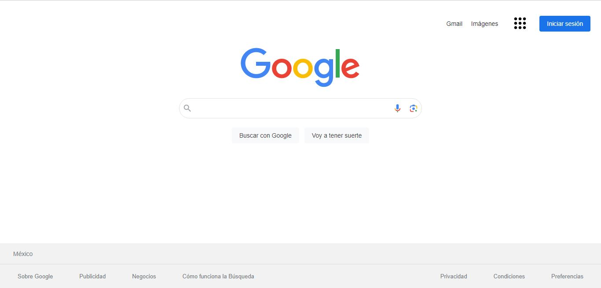

# Clon de Google utilizando HTML y CSS
Proyecto realizado con la intención de aplicar los conocimientos obtenidos en el Bootcamp de Tecnolochicas PRO Summer Camp.

Puedes poner en práctica tus habilidades revisando y utilizando el código a continuación.

## ÍNDICE
* [1. Intro](url)
* [2. Demo](url)
* [3. ¿Qué construirás?](url)
* [4. Objetivos de aprendizaje](url)
* [5. Requisitos](url)
****
## 1. Intro
HTML trabaja de la mano con CSS para crear las páginas web que usamos todos los días en el navegador. Incluso, este sitio web en donde estás viendo este contenido está construido con HTML y CSS (junto con otros elementos que conocerás más adelante). Para este primer proyecto, con los conocimientos que tienes de HTML y CSS realizarás la clonación de la interfaz de Google, sí, esa que ves cada que haces una búsqueda en su navegador, ¿aceptas el reto?

## 2. Demo
Puedes entrar a ver el demo en este vínculo: https://main--ephemeral-pegasus-837de6.netlify.app/

***La idea es inspirarte con esta demostración de proyecto.***

## 3. ¿Qué construirás?
Este proyecto está enfocado en construir la interfaz estática de Google.

Se te pide que sea una sola página que contenga las secciones siguientes:

 1. **Header**:Sección que involucra la foto del perfil, iconos, logo de Google y las áreas principales del sitio.
 2. **Main**:Sección del contenedor para los elementos centrales de la página.
 3.  **Footer**:Sección que incluye hipervínculos al final de la página.

## 4. Objetivos de aprendizaje
El objetivo principal de este proyecto es desarrollar una interfaz utilizando HTML y CSS, en toda su aplicación.

**Aplicarás:**
- Etiquetas estándar HTML5.
- Estilos con CSS
  
## 5. Requisitos
 ### GENERAL
- Realizarse de manera individual
 ### UI
 - Aplicar en todo el sitio HTML semántico de estándar no.5 (HTML5).
 - Aplicar tipos de selectores en CSS.
 - Sección: `Header`, `main`, `footer`
